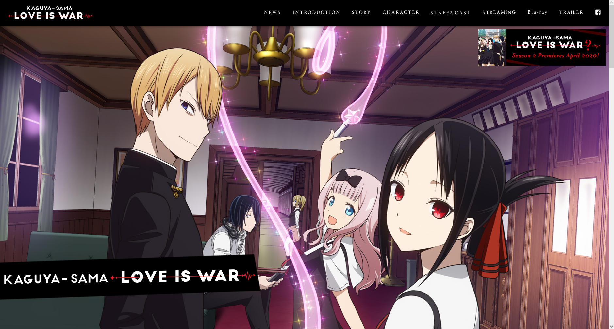
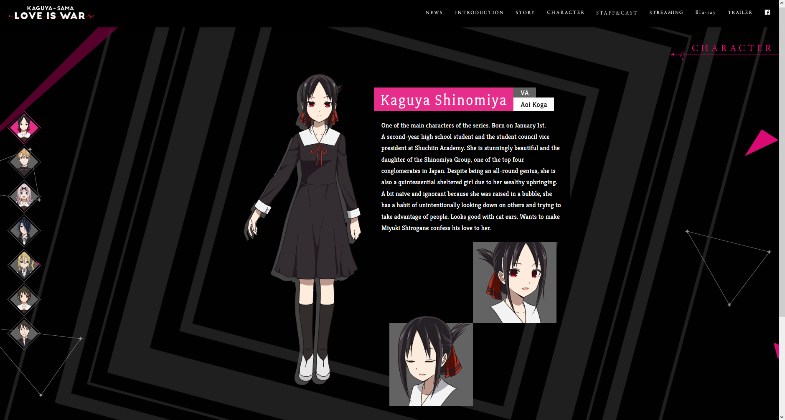
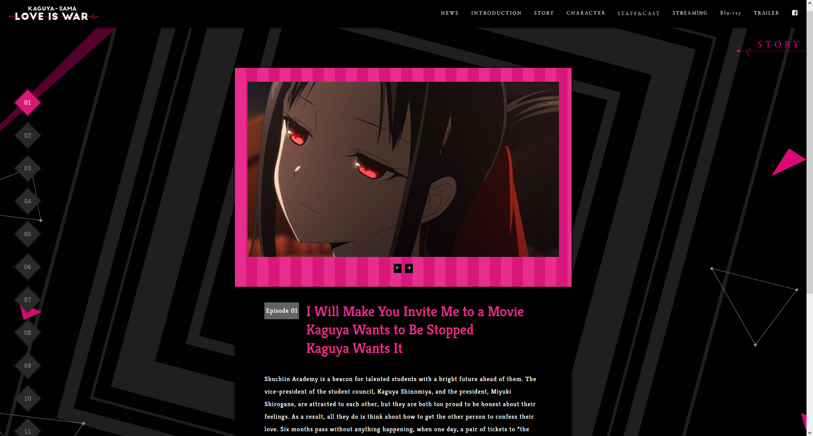

# Clon de Kaguya-sama: Love is War - Página web

Este es un clon de la página web oficial de Kaguya-sama: Love is War versión Ingles, desarrollado utilizando React, Vite y MUI (Material-UI).

Página original clonada:

-  Primera Temporada: https://kaguyasama-anime.com/1st (Faltan detalles)
-  Segunda Temporada: https://kaguyasama-anime.com/2nd (En desarollo)
-  Tercera Temporada: https://kaguyasama-anime.com/3rd (Proximamente)
-  Pelicula / Cuarta Temporada: https://kaguyasama-anime.com (Proximamente)

## Descripción

Este proyecto es una recreación de la página web oficial de Kaguya-sama: Love is War, una popular serie de anime y manga. La página web clonada incluye varias secciones como la página de inicio, información del anime, personajes, galería de imágenes y más. El objetivo principal de este proyecto es demostrar el uso de tecnologías modernas como React, Vite y MUI para construir una interfaz de usuario atractiva y receptiva. Además de mostrar la comparativa de la evolución de la página a través de sus temporadas ya que cada una presenta un diseño único y característico pero con el mismo aura de la serie

## Capturas de pantalla

Aquí hay algunas capturas de pantalla de la página web clonada:



)

## Características

-  Página de inicio con información general sobre Kaguya-sama: Love is War.
-  Sección de personajes con detalles de los principales personajes del anime.
-  Galería de imágenes con una selección de imágenes promocionales y de los personajes.
-  Página de información del anime con sinopsis y detalles sobre la producción.
-  Diseño receptivo que se adapta a diferentes tamaños de pantalla.

## Tecnologías utilizadas

-  React: Biblioteca de JavaScript para construir interfaces de usuario.
-  Vite: Herramienta de compilación rápida y flexible para aplicaciones web modernas.
-  MUI (Material-UI): Biblioteca de componentes de interfaz de usuario basada en Material Design.

## Instalación

1. Clona este repositorio en tu máquina local:

```bash
git clone https://github.com/Nzone56/KaguyaClonePage.git
```

2. Navega al directorio del proyecto:

```bash
cd KAGUYA-CLONE
```

3. Instala las dependencias utilizando npm o yarn:

```bash
npm install
```

```bash
yarn install
```

4. Inicia la aplicación:

```bash
npm run dev
```

```bash
yarn dev
```

5. Abre tu navegador y ve a `http://localhost:5173/` para ver la página web clonada de Kaguya-sama: Love is War.

## Contribución

Las contribuciones son bienvenidas. Si quieres mejorar este proyecto, siéntete libre de enviar pull requests. Antes de enviar una solicitud, asegúrate de seguir las mejores prácticas y las pautas de estilo de código.

## Licencia

Este proyecto está bajo la licencia [MIT](LICENSE).

## Créditos

Este clon de la página web de Kaguya-sama: Love is War fue desarrollado por [Julian Andres Pereira ](https://github.com/Nzone56).

Agradecimientos especiales a los creadores originales de [Kaguya-sama: Love is War](https://kaguyasama-anime.com) por la inspiración y los recursos proporcionados.

## Contacto

Si tienes alguna pregunta o sugerencia relacionada con este proyecto, puedes contactarme a través de mi dirección de correo electrónico: jpereirap@unal.edu.co.

## Estado del proyecto

Este proyecto se encuentra actualmente en desarrollo. Actualmente está disponible la primera temporada y se ha añadido una landing page que lleva a la selección de temporada. Toma en cuenta que el clon no es 100% exacto, ya que se han realizado algunos cambios a gusto personal. El proyecto todavía no es responsive y faltan algunos detalles por completar (Ver la lista de 'TODOS').
