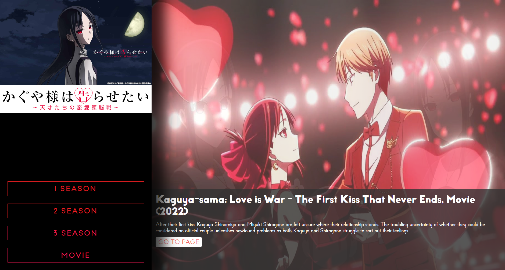
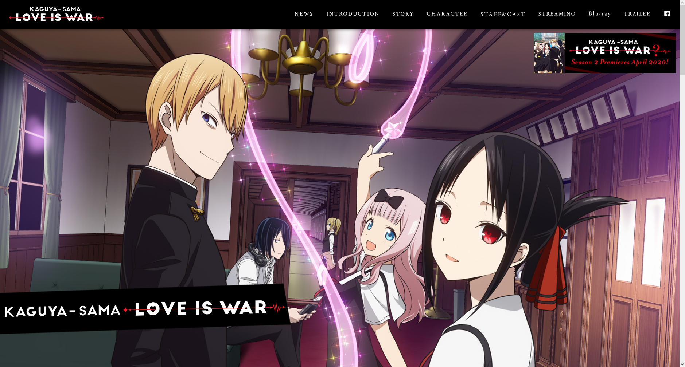
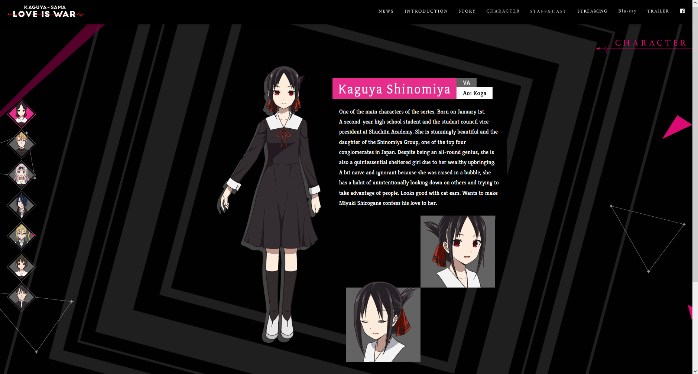
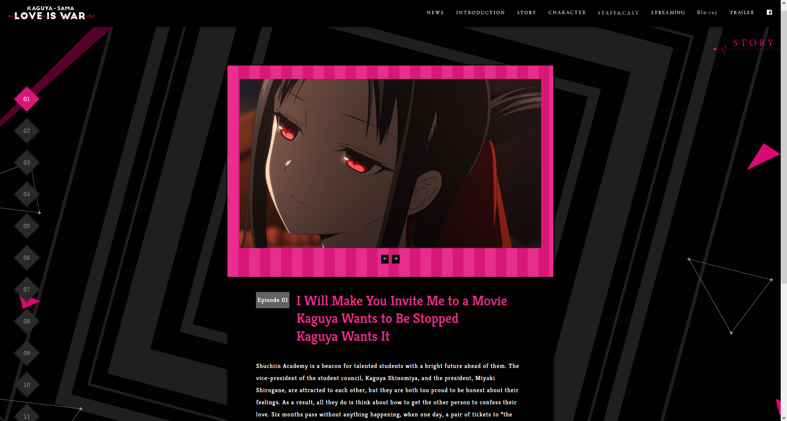

# Kaguya-sama: Love is War Clone - Website

This is an English version clone of the official Kaguya-sama: Love is War website, developed using React, Vite, and MUI (Material-UI).

Cloned original pages:

-  First Season: [https://kaguyasama-anime.com/1st](https://kaguyasama-anime.com/1st) (Some details are missing)
-  Second Season: [https://kaguyasama-anime.com/2nd](https://kaguyasama-anime.com/2nd) (Under development)
-  Third Season: [https://kaguyasama-anime.com/3rd](https://kaguyasama-anime.com/3rd) (Coming soon)
-  Movie: [https://kaguyasama-anime.com](https://kaguyasama-anime.com) (Coming soon)

## Description

This project is a recreation of the official Kaguya-sama: Love is War website, a popular anime and manga series. The cloned website includes various sections such as the home page, anime information, characters, image gallery, and more. The main objective of this project is to demonstrate the use of modern technologies like React, Vite, and MUI to build an attractive and responsive user interface. Additionally, it showcases the evolution of the website throughout its seasons, as each one presents a unique and characteristic design while maintaining the essence of the series.

## Project Status

This project is currently in development. The first season is currently available, and a landing page leading to the season selection has been added. Please note that the clone is not 100% exact, as some changes have been made for personal preference. The project is not yet responsive, and some details are yet to be completed (refer to the 'TODO' list).

## Screenshots

Here are some screenshots of the cloned website:

### Landing Page

<br>



### Season 1 Page

<br>





## Features

-  Home page with general information about Kaguya-sama: Love is War.
-  Characters section with details of the main anime characters.
-  Image gallery with a selection of promotional and character images.
-  Anime information page with synopsis and production details.

## Technologies Used

-  React: JavaScript library for building user interfaces.
-  Vite: Fast and flexible development build tool for modern web applications.
-  MUI (Material-UI): UI component library based on Material Design.

## Installation

1. Clone this repository to your local machine:

```bash
git clone https://github.com/Nzone56/KaguyaClonePage.git
```

2. Navigate to the project directory:

```bash
cd KAGUYA-CLONE
```

3. Install the dependencies using npm or yarn:

```bash
npm install
```

```bash
yarn install
```

4. Start the application:

```bash
npm run dev
```

```bash
yarn dev
```

5. Open your browser and go to http://localhost:5173/ to see the cloned Kaguya-sama: Love is War website.

## License

This project is licensed under the [MIT](LICENSE).

## Credits

This clone of the Kaguya-sama: Love is War website was developed by [Julian Andres Pereira ](https://github.com/Nzone56).

Special thanks to the original creators of [Kaguya-sama: Love is War](https://kaguyasama-anime.com) for the inspiration and provided resources.

## Contact

If you have any questions or suggestions related to this project, you can contact me via email at jpereirap@unal.edu.co.
